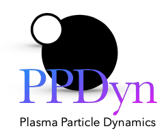

# PPDyn (Plasma Particle Dynamics)
[](https://github.com/sayanadhikari/PPDyn/actions/workflows/main.yml)
[](https://github.com/sayanadhikari/PPDyn/actions/workflows/make.yml)
[](https://zenodo.org/badge/latestdoi/349242730)
[](https://ppdyn.readthedocs.io/en/latest/?badge=latest)
[](https://pypi.org/project/PPDyn/)
[](https://mybinder.org/v2/gh/sayanadhikari/PPDyn/main)

A python code to simulate plasma particles using Molecular Dynamics Algorithm. [Numba JIT compiler](https://numba.pydata.org/) for Python has been implemented for faster performance.

A detailed documentation can be found at https://ppdyn.readthedocs.io/.

<!-- <video src="assets/videos/Plasma Particle Dynamics using Molecular Dynamics Method.mp4" poster="assets/images/ppdyn_poster.png" width="320" height="200" controls preload></video> -->

Example:


<!--[](https://user-images.githubusercontent.com/11753189/114286735-b5f26900-9a61-11eb-86ba-76ee295d6448.mp4)-->
<!--[](https://www.youtube.com/embed/qvQRUX-rSrQ)-->


## Problem
<!--Rayleigh Problem = gas between 2 plates ([Alexander & Garcia, 1997](https://doi.org/10.1063/1.168619)) -->

## Contributors
- [Sayan Adhikari](https://github.com/sayanadhikari), UiO, Norway. [@sayanadhikari](https://twitter.com/sayanadhikari)
- [Rupak Mukherjee](https://github.com/RupakMukherjee), PPPL, USA.
- [Gaute Holen](https://github.com/GauteHolen), UiO, Norway (See separate branch, [dust-exp])
- [Rinku Mishra](https://github.com/rinku-mishra), IPR, India (See separate branch, [dust-void])

## Installation
### Prerequisites
1. [GNU Make](https://www.gnu.org/software/make/)
2. [python3 or higher](https://www.python.org/download/releases/3.0/)
3. [git](https://git-scm.com/)

### Procedure
#### Using Anaconda/Miniconda (Preferred)
First make a clone of the master branch using the following command
```shell
git clone https://github.com/sayanadhikari/PPDyn.git
```
Then enter inside the *PPDyn* directory
```shell
cd PPDyn
```
Now create a conda environment using the given *environment.yml* file
```shell
conda env create -f environment.yml
```
Activate the conda environment
```shell
conda activate ppdyn
```
*Usage*

Upon successful compilation, run the code using following command
```shell
python ppdyn.py -i input.ini
```
#### Using PyPI
```bash
pip install PPDyn
```
*Usage*

Download the input template to your working directory
```shell
wget https://raw.githubusercontent.com/sayanadhikari/PPDyn/main/input.ini
```
Now, either create a python script in your working directory or use your python console
```python
from PPDyn import ppdyn
from PPDyn.ppdplot import animate
import time

start = time.time()
ppdyn(input)
end = time.time()
print("Elapsed (after compilation) = %s"%(end - start)+" seconds")
animate()
```
#### Using GNU Make
First make a clone of the master branch using the following command
```shell
git clone https://github.com/sayanadhikari/PPDyn.git
```
Then enter inside the *PPDyn* directory
```shell
cd PPDyn
```
Now complile and built the *PPDyn* code
```shell
make all
```
*Usage*

Upon successful compilation, run the code using following command
```shell
ppdyn -i input.ini
```
## Parameter Setup
Edit the _input.ini_ and run the code again. The basic structure of _input.ini_ is provided below,
```ini
;
; @file		input.ini
; @brief	PPDyn inputfile.
;
;scope = default

[simbox]
Lx  = 15.0    ; System length in X
Ly  = 15.0    ; System length in Y
Lz  = 20.0    ; System length in Z

[particles]
N     = 1000 ; Number of particles
Vxmax = 1.0     ; Maximum velocity in X
Vymax = 1.0     ; Maximum velocity in Y
Vzmax = 1.0     ; Maximum velocity in Z
Temp  = 0.1     ;
dist = True     ; Use distribution: True
mean = 1  ; if dist = True
stdDev = 0.2  ; if dist = True

[screening]
k = 0.0

[gravity]
g_0= 0.0063;    Reduced Earth's gravity

[cutoff radius]
rc = 1e-5

[boundary]
btype = mixed ; Type of boundary Options: periodic, reflecting, mixed

[time]
tmax  = 10.0    ; Final time
dt    = 0.010   ; time step size

[diagnostics]
dumpPeriod  = 5    ; Data dump period
dumpData    = True
vtkData     = True
realTime    = False

[directory]
dataDir = data #put runname here

[options]
parallelMode  = True ;True ;set to false to disable parallel
```
## Visualization
For visualization, user either can use the python scripts available inside ``scripts`` directory or can write their own. After successful run the data will be available under ``data`` directory. Two different data formats are available at present. The complete dataset will available under the name particle.hdf5. For vtk visualization users can use ``.vtu`` files inside ``data/vtkdata``. [Paraview](https://www.paraview.org/) can be used to animate particle dynamics very easily. A sample video can be found [here](https://www.youtube.com/embed/qvQRUX-rSrQ).


## Contributing
We welcome contributions to this project.

1. Fork it.
2. Create your feature branch (```git checkout -b my-new-feature```).
3. Commit your changes (```git commit -am 'Add some feature'```).
4. Push to the branch (```git push origin my-new-feature```).
5. Create new Pull Request.

## License
Released under the [MIT license](LICENSE).
