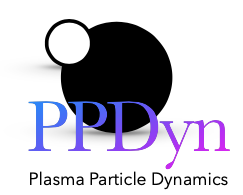

# PPDyn (Plasma Particle Dynamics)
[](https://github.com/sayanadhikari/PPDyn/actions/workflows/main.yml)
[](https://github.com/sayanadhikari/PPDyn/actions/workflows/make.yml)
[](https://zenodo.org/badge/latestdoi/349242730)
[](https://ppdyn.readthedocs.io/en/latest/?badge=latest)
[](https://pypi.org/project/PPDyn/)
[](https://mybinder.org/v2/gh/sayanadhikari/PPDyn/main)

A Python code to simulate plasma particles using Molecular Dynamics Algorithm. [Numba JIT compiler](https://numba.pydata.org/) for Python has been implemented for faster performance.

A detailed documentation can be found at https://ppdyn.readthedocs.io/.

<!-- <video src="assets/videos/Plasma Particle Dynamics using Molecular Dynamics Method.mp4" poster="assets/images/ppdyn_poster.png" width="320" height="200" controls preload></video> -->

Example:


## Table of Contents

- [Features](#features)
- [Installation](#installation)
- [Quick Start](#quick-start)
- [Cubesat Geometry and Field Generator](#cubesat-geometry-and-field-generator)
- [Usage](#usage)
- [Configuration](#configuration)
- [Visualization](#visualization)
- [Performance Tips](#performance-tips)
- [Troubleshooting](#troubleshooting)
- [Contributing](#contributing)
- [License](#license)

## Features

- **Molecular Dynamics Simulation**: High-performance plasma particle dynamics using Numba JIT compilation
- **Parallel Processing**: Multi-threaded particle integration for faster simulations
- **PIC Field Coupling**: Support for external electric fields from PIC simulations
- **Object Interaction**: Particle absorption, reflection, and attachment to objects
- **Cubesat Support**: Built-in cubesat geometry and electric field generator (removes PINC dependency)
- **Visualization**: VTK output for Paraview visualization
- **Flexible Boundaries**: Periodic, reflecting, or mixed boundary conditions

## Installation

### Prerequisites

1. [GNU Make](https://www.gnu.org/software/make/) (optional, for make-based installation)
2. [Python 3.7 or higher](https://www.python.org/download/releases/3.0/)
3. [Git](https://git-scm.com/)
4. **Gmsh** (for cubesat generator - see below)

### Procedure

#### Using Anaconda/Miniconda (Preferred)

1. Clone the repository:
```shell
git clone https://github.com/sayanadhikari/PPDyn.git
cd PPDyn
```

2. Create conda environment:
```shell
conda env create -f environment.yml
conda activate ppdyn
```

3. Install additional dependencies for cubesat generator:
```shell
pip install gmsh tqdm
```

#### Using PyPI

```bash
pip install PPDyn
pip install gmsh tqdm  # For cubesat generator
```

#### Using GNU Make

```shell
git clone https://github.com/sayanadhikari/PPDyn.git
cd PPDyn
make all
```

## Quick Start

### Basic PPDyn Simulation

1. **Run with default input**:
```shell
python src/main.py
```

2. **Or use the legacy interface**:
```shell
python ppdyn.py -i input.ini
```

### With Cubesat Geometry

1. **Generate cubesat geometry and electric field**:
```shell
python src/generate_cubesat_fields.py -c cubesat_config.ini
```

2. **Update `input.ini`**:
```ini
[directory]
picDir = PIC_data

[options]
PIC_data = True
object_data = True
use_mesh_directly = True  ; Use exact Gmsh mesh for visualization
```

3. **Run PPDyn**:
```shell
python src/main.py
```

## Cubesat Geometry and Field Generator

The cubesat generator is a standalone tool that creates realistic cubesat geometries and computes electric fields around them, removing the dependency on PINC.

### Features

- **Cubesat Geometry Generation**: Creates realistic cubesat geometries (1U, 2U, 3U, 6U) with solar panel wings
- **Finite Element Meshing**: Uses Gmsh for high-quality mesh generation
- **Electric Field Solver**: Solves Poisson's equation to compute electric field around charged cubesats
- **PPDyn Compatibility**: Exports to HDF5 format directly readable by PPDyn
- **Mesh Visualization**: Option to use exact Gmsh mesh for visualization instead of voxel grid

### Installation

Install Gmsh (required for cubesat generator):

```bash
# Via conda (recommended)
conda install -c conda-forge gmsh

# Or via pip
pip install gmsh

# Or system package (Ubuntu/Debian)
sudo apt-get install libgmsh-dev python3-gmsh
```

### Usage

#### Basic Usage

```bash
# Generate with default configuration
python src/generate_cubesat_fields.py

# Or specify custom config
python src/generate_cubesat_fields.py -c cubesat_config.ini -o PIC_data
```

#### Example: 3U Cubesat with Deployed Wings

1. Edit `cubesat_config.ini`:
```ini
[cubesat]
size = 3U
wing_config = deployed
wing_length = 0.20
include_antenna = False

[domain]
Lx = 1.0
Ly = 1.0
Lz = 1.0
nx = 150
ny = 150
nz = 150

[electric_field]
floating_potential = 2.5
solver_method = sparse
use_iterative = False  ; Use direct solver (more reliable)
```

2. Generate:
```bash
python src/generate_cubesat_fields.py -c cubesat_config.ini
```

3. Update `input.ini` to match domain:
```ini
[simbox]
Lx = 1.0
Ly = 1.0
Lz = 1.0
```

### Output Files

The generator produces:

- **`PIC_data/E.grid.h5`**: Electric field data (Ex, Ey, Ez) compatible with PPDyn
- **`PIC_data/object.grid.h5`**: Object geometry mask (binary voxel grid)
- **`PIC_data/cubesat.msh`**: Gmsh mesh file (for visualization and exact mesh mode)

### Configuration Options

Edit `cubesat_config.ini` to customize:

#### Cubesat Parameters
- `size`: Cubesat size (`1U`, `2U`, `3U`, `6U`)
- `wing_config`: Wing configuration (`standard`, `deployed`, `none`)
- `wing_length`: Length of solar panel wings in meters
- `include_antenna`: Include antenna elements (True/False)

#### Domain Parameters
- `Lx`, `Ly`, `Lz`: Domain size in meters (must match PPDyn `input.ini`)
- `nx`, `ny`, `nz`: Grid resolution (higher = more accurate but slower)

#### Electric Field Parameters
- `floating_potential`: Floating potential in volts
- `solver_method`: Solver method (`sparse`, `fd`, or `fast`)
- `fast_mode`: Use fast approximation (True/False) - good for testing
- `use_iterative`: Use iterative solver (`True`, `False`, or `auto`)

## Usage

### PPDyn Configuration

Edit `input.ini` to configure your simulation:

```ini
;
; @file		input.ini
; @brief	PPDyn inputfile.
;

[simbox]
Lx  = 0.5    ; System length in X (must match cubesat_config.ini if using cubesat)
Ly  = 0.5    ; System length in Y
Lz  = 0.5    ; System length in Z

[particles]
N     = 200  ; Number of particles
Vxmax = 1.0  ; Maximum velocity in X
Vymax = 1.0  ; Maximum velocity in Y
Vzmax = 1.0  ; Maximum velocity in Z
Temp  = 0.1  ; Temperature
dist = gaussian  ; Distribution type: gaussian, uniform_radius
mean = 1     ; Mean (for gaussian)
stdDev = 0.2 ; Standard deviation (for gaussian)
density = 1000  ; Density in kg/m³ (for uniform_radius)
r_min = 0.001   ; Minimum radius in meters
r_max = 0.01    ; Maximum radius in meters

[screening]
k = 0.0

[gravity]
g_0 = 0.0  ; Reduced Earth's gravity (set to 0.0 for space simulations)

[cutoff radius]
rc = 1e-5

[boundary]
btype = periodic  ; Type of boundary: periodic, reflecting, mixed

[time]
tmax  = 10.0    ; Final time
dt    = 0.010   ; Time step size

[diagnostics]
dumpPeriod  = 5    ; Data dump period
dumpData    = True
vtkData     = True
realTime    = False

[directory]
dataDir = data     ; Output directory for simulation data
picDir = PIC_data  ; Path to electric field and object data

[options]
parallelMode  = True      ; Enable parallel processing
PIC_data = True          ; Enable PIC field coupling
object_data = True       ; Enable object interaction
use_mesh_directly = True  ; Use exact Gmsh mesh for visualization (requires cubesat.msh)
E_norm_method = mean     ; Electric field normalization: 'mean', 'max', or 'norm'
```

### Running Simulations

#### Standard Simulation
```bash
python src/main.py
```

#### With Cubesat Geometry
```bash
# Step 1: Generate cubesat and field
python src/generate_cubesat_fields.py -c cubesat_config.ini

# Step 2: Run simulation
python src/main.py
```

## Configuration

### PPDyn Input Parameters

Key parameters in `input.ini`:

- **`[simbox]`**: Simulation domain size (must match cubesat domain if using cubesat)
- **`[particles]`**: Particle properties (number, velocities, distribution)
- **`[options]`**: 
  - `PIC_data`: Enable electric field coupling
  - `object_data`: Enable object interaction
  - `use_mesh_directly`: Use exact mesh for visualization (requires `cubesat.msh`)
  - `E_norm_method`: Field normalization method

### Cubesat Generator Configuration

Key parameters in `cubesat_config.ini`:

- **`[cubesat]`**: Geometry parameters (size, wings, antenna)
- **`[domain]`**: Domain size and resolution (must match PPDyn `input.ini`)
- **`[electric_field]`**: Solver settings and floating potential

## Visualization

### Paraview Visualization

After running a simulation, visualize results in Paraview:

1. **Particle Data**: Open `data/vtkdata/points_*.vtu` files
2. **Object Geometry**: Open `data/vtkdata/object_mesh.vtu`
   - If `use_mesh_directly = True`, shows exact Gmsh mesh geometry
   - Otherwise shows voxel grid representation
   - Impact heatmap data is included for visualization

### Python Scripts

Use scripts in the `scripts/` directory:

```bash
# Animate particle dynamics
python scripts/animate.py

# Energy analysis
python scripts/energy.py

# Velocity quiver plot
python scripts/velocity_quiver.py
```

## Performance Tips

### Fast Testing Mode

For quick testing with cubesat generator:

```ini
[domain]
nx = 50   ; Reduce resolution
ny = 50
nz = 50

[electric_field]
solver_method = fast    ; Fast approximation
fast_mode = True
```

This completes in seconds instead of minutes.

### Production Settings

```ini
[domain]
nx = 100
ny = 100
nz = 100

[electric_field]
solver_method = sparse
fast_mode = False
use_iterative = False  ; Direct solver (more reliable)
```

### Solver Performance

| Method | Speed | Accuracy | Memory | Use Case |
|--------|-------|----------|--------|----------|
| `fast` | ⚡⚡⚡ Very Fast | ⚠️ Approximate | Low | Testing |
| `sparse` (direct) | ⚡⚡ Fast | ✅ Accurate | Medium | Small grids (<50k) |
| `sparse` (iterative) | ⚡ Moderate | ✅ Accurate | Low | Large grids (>50k) |

**Note**: The direct solver is more reliable but slower. For grids > 50,000 points, consider using iterative solver, but be aware it may not converge for all cases.

### Progress Monitoring

The field solver shows real-time progress:
- Elapsed time updates every 2 seconds
- Solver type (direct/iterative)
- Grid size information
- Convergence status

## Troubleshooting

### Common Issues

#### Gmsh Not Found
```bash
# Install Gmsh
conda install -c conda-forge gmsh
# OR
pip install gmsh
```

#### Memory Issues with Large Grids
- Reduce grid resolution (`nx`, `ny`, `nz`)
- Use `sparse` solver method
- Use iterative solver for large grids

#### Electric Field Not Converging
- Increase domain size relative to cubesat
- Check that domain is much larger than cubesat
- Use direct solver (`use_iterative = False`)
- Check for NaN/Inf values in output

#### NaN Energy Values in Simulation
- Regenerate field with direct solver
- Check field clipping (should be < 1 MV/m)
- Verify domain sizes match between `input.ini` and `cubesat_config.ini`
- Check that `E_norm_method = mean` for cubesat-generated fields

#### CG Solver Not Converging
- The code automatically falls back to direct solver
- For reliability, set `use_iterative = False` in `cubesat_config.ini`

#### Geometry Looks Different in Visualization
- If using `use_mesh_directly = True`, ensure `cubesat.msh` exists in `PIC_data/`
- The voxel grid shows a bounding box; the mesh shows exact geometry
- Impact heatmap is mapped to mesh triangles when using mesh mode

### Getting Help

- Check the [documentation](https://ppdyn.readthedocs.io/)
- Review `TROUBLESHOOTING.md` for detailed solutions
- Open an issue on [GitHub](https://github.com/sayanadhikari/PPDyn/issues)

## Architecture

### PPDyn Core Modules

- **`src/main.py`**: Main simulation orchestration
- **`src/pusher_parallel.py`**: Numba-accelerated Verlet integrator
- **`src/init.py`**: Initialization and field loading
- **`src/config.py`**: Configuration parsing
- **`src/diagn.py`**: Diagnostics and data output
- **`src/vtk_data.py`**: VTK visualization export

### Cubesat Generator Modules

- **`src/cubesat_generator.py`**: Generates cubesat geometry using Gmsh
- **`src/geometry_to_grid.py`**: Converts unstructured mesh to regular voxel grid
- **`src/field_solver.py`**: Solves Poisson equation for electric field
- **`src/hdf5_exporter.py`**: Exports data to PPDyn-compatible HDF5 format
- **`src/generate_cubesat_fields.py`**: Main orchestration script

## Contributors

- [Sayan Adhikari](https://github.com/sayanadhikari), UiO, Norway. [@sayanadhikari](https://twitter.com/sayanadhikari)
- [Rupak Mukherjee](https://github.com/RupakMukherjee), PPPL, USA.
- [Gaute Holen](https://github.com/GauteHolen), UiO, Norway (See separate branch, [dust-exp])
- [Rinku Mishra](https://github.com/rinku-mishra), IPR, India (See separate branch, [dust-void])

## Contributing

We welcome contributions to this project.

1. Fork it.
2. Create your feature branch (`git checkout -b my-new-feature`).
3. Commit your changes (`git commit -am 'Add some feature'`).
4. Push to the branch (`git push origin my-new-feature`).
5. Create new Pull Request.

Please see `CONTRIBUTING.md` for detailed guidelines.

## License

Released under the [MIT license](LICENSE).

## Citation

If you use PPDyn in your research, please cite:

```bibtex
@software{ppdyn,
  title = {PPDyn: Plasma Particle Dynamics},
  author = {Adhikari, Sayan and Mukherjee, Rupak},
  year = {2021},
  url = {https://github.com/sayanadhikari/PPDyn},
  doi = {10.5281/zenodo.XXXXXXX}
}
```

## Related Documentation

- [Full Documentation](https://ppdyn.readthedocs.io/)
- [Quick Start Guide](QUICKSTART_CUBESAT.md) - Quick cubesat generator guide
- [Performance Tips](PERFORMANCE_TIPS.md) - Optimization guide
- [Troubleshooting Guide](TROUBLESHOOTING.md) - Common issues and solutions
